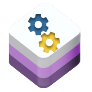

<h1 style="text-align: center;">
  Awesome-ctl </>
</h1>


<center>
<h1>AI-Powered Diagnostics for Your Entire Stack 🧠 </h1>
</center>
<center>

[](LICENSE)

</center>


## Table of Contents

- [Introduction](#introduction)
- [Key Features](#key-features)
- [Getting Started](#getting-started)
    - [Prerequisites](#prerequisites)
    - [Installation](#installation)
    - [Usage](#usage)
- [Project Structure](#project-structure)
- [Contributing](#contributing)
- [License](#license)
- [Acknowledgements](#acknowledgements)


> Tired of wrestling with cryptic error messages and complex troubleshooting? **awesome-ctl** is like having a seasoned expert on call 24/7, using the power of AI to provide clear, actionable diagnoses for your infrastructure and applications.

**awesome-ctl** is a command-line tool that brings cutting-edge LLM (Large Language Model) technology to the forefront of systems diagnostics.  Connect **awesome-ctl** to your Kubernetes cluster, Docker Swarm, AWS environment, or other supported systems, and let our AI analyze the data to help you find and fix issues faster.

## ✨  Key Features

* **🧠  AI-Driven Insights:**  **awesome-ctl** leverages the reasoning power of LLMs to analyze complex technical data and provide human-readable diagnoses and recommendations.
* **🔌 Extensible Connector Architecture:**  Easily connect to a variety of systems and services:
    - **Kubernetes:** Get to the bottom of pod crashes, deployment issues, resource bottlenecks, and more.
    - **Docker:** Diagnose container failures, image build problems, and networking issues.
    - **AWS (Coming Soon):**  Analyze CloudWatch logs, EC2 instance health, and other AWS services.
    - **More to Come:**  We're constantly adding support for new systems!
* **🔍  Deep System Analysis:**  **awesome-ctl** gathers the essential information to provide comprehensive diagnoses:
    - Logs and Events:  Analyze system and application logs to identify errors, warnings, and patterns.
    - Resource Utilization: Understand CPU, memory, network usage, and other metrics to spot bottlenecks.
    - Configuration Data:  Detect misconfigurations and potential conflicts.
* **🛠 Actionable Recommendations:**  Don't just identify problems - fix them! **awesome-ctl** provides clear steps and guidance to help you resolve issues quickly.
* **🤖 Easy-to-Use CLI:**  A simple and intuitive command-line interface makes diagnostics a breeze.

## 🚀 Getting Started

### 🛠 Prerequisites

* **Python 3.8+:**  The language of **awesome-ctl**.
* **Connectors:** Install the necessary connector libraries for the systems you want to diagnose (e.g., `kubernetes`, `docker`).

### 📥 Installation

```bash
poetry add awesome-ctl
```

💻 Usage

Basic Diagnostics:
```bash
awesome-ctl diagnose <connector> [options]
```

# Example:
```bash
awesome-ctl diagnose kubernetes --namespace my-app # Analyze issues in the "my-app" namespace
awesome-ctl diagnose aws # Analyze issues with AWS resources
```

# See available connectors and options:
```sh
awesome-ctl --help
```

📂 Project Structure

- awesome-ctl/: The core Python package.
- agents/: Contains connector plugins that gather data from different systems.
- llm/: Manages interaction with Large Language Models.
- analysis/: Core logic for analysis, diagnosis, and report generation.
- awesome-ctl_cli/: The command-line interface.
- tests/: Keep things running smoothly with a comprehensive test suite.


🙌 Contributing

- awesome-ctl is a community-driven open-source project! We welcome contributions from developers of all levels. Here's how to get involved:
  - Open an issue: Report a bug, request a feature, or share your ideas.
  - Submit a pull request: Contribute code, documentation, or anything you think can improve awesome-ctl.


📄 License

This project is licensed under the MIT License. For more details, see the LICENSE file.

**Key Changes:**

- **Scope Emphasis:**  The README now clearly positions `awesome-ctl` as a general-purpose diagnostic tool with LLM-powered analysis at its core.
- **Connector Focus:** Highlights the extensibility of the project through connectors while providing examples.
- **Actionable Focus:** Emphasizes that `awesome-ctl` helps users not only find but also fix problems.

## Awesome CloudOps Automation License

Please find the LICENSE of Awesome-CloudOps-Automation [here](https://github.com/unskript/Awesome-CloudOps-Automation/blob/master/License)

## Acknowledgements
We would like to acknowledge the original [Awesome-CloudOps-Automation](https://github.com/unskript/Awesome-CloudOps-Automation) contributors for their hard work and dedication. Their efforts have laid the foundation for this project, and we are grateful for their contributions.